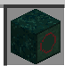
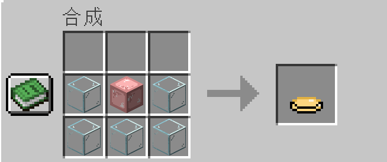

# 生物抗药性模组 (Bioresistance Mod)

本模组为Minecraft添加了一系列与生物抗药性相关的物品、疾病机制和治疗方案，通过模拟现实世界中细菌耐药性的问题，为游戏增添了生物医学领域的挑战。

> 声明：本模组为南方科技大学 2025 IGEM比赛队伍Sustech-Bio创作，版权声明在文档最下方

## 基础系统介绍

本模组构建了一套完整的生物抗药性系统，模拟了现实中微生物对药物产生耐药性的过程。当玩家使用特定药物治疗疾病时，相应的病原体会逐渐产生耐药性，使药物逐渐失效。这迫使玩家需要研发更先进的抗耐药性药物来解决问题。

## 物品详细说明

### 培养基系列
- **培养基 (*Medium*)** ：

  基础的微生物培养材料，无法直接使用，需要经过消毒处理。
- **培养基(已消毒) (*Medium Sterilized*)** ：

  在高压釜中处理过的无菌培养基，可安全接种特定微生物。是所有微生物培养的起点。
- **大肠杆菌培养基 (*E_coli_medium*)** ：

  含有活性大肠杆菌的培养基，是合成T6SS系统的关键材料。培养基中的大肠杆菌可以通过与新的消毒培养基混合来扩增菌种。
- **西瓜噬酸菌培养基 (*Acidovorax_citrulli_medium*)** ：

  含有西瓜噬酸菌的特殊培养基，这种细菌含有T6SS系统的天然基因，可在质粒提取器中提取关键DNA片段。
- **装配T6SS的大肠杆菌培养基 (*E_coli_t6ss_medium*)** ：

  经过基因工程改造的大肠杆菌，含有来自西瓜噬酸菌的T6SS系统，能够有效对抗耐药性病原体，是制作高级药物的核心原料。

### 药物系列
- **甲硝唑 (*Metronidazole*)** ：

  抗厌氧菌药物，可有效治疗破伤风。使用方式为右键点击使用，每次使用都会增加0.1%的破伤风杆菌耐药性，物品提示会显示当前耐药性百分比。
- **链霉素 (*Streptomycin*)** ：

  抗菌素类药物，针对鼠疫杆菌有效。使用方式为右键点击使用，每次使用都会增加鼠疫杆菌的耐药性。
- **抗真菌药物 (*Antifungal_drug*)** ：

  特异性抗真菌药物，可治疗耳念珠菌感染。使用方式为右键点击使用，每次使用都会增加耳念珠菌的耐药性。
- **抗耐药性微生物胶囊 (*Anti_drug_resistant_microbial_capsules*)** ：

  利用T6SS研发的革命性药物，能够对抗所有具有耐药性的病原体，不会导致病原体产生新的耐药性。是治疗所有感染的终极解决方案。
- **抗耐药性微生物软膏 (*Anti_drug_resistant_microbial_ointment*)** ：

  T6SS与水凝胶结合的外用产品，适用于皮肤感染，同样不会导致耐药性产生。

### 实验材料与工具
- **注射器 (*Syringe*)** ：

  多功能实验工具，用于精确提取微生物和注射药物。是许多合成配方的必备工具。由铁粒和玻璃在工作台合成。
- **水凝胶 (*Hydrogel*)** ：

  高分子材料，具有良好的生物相容性，是制作抗耐药性微生物软膏的载体。
- **空胶囊 (*Empty_capsule*)** ：

  药物包装材料，用于包装活性成分，确保药物能够安全到达体内特定部位。
  
- **土壤浸取液桶 (*Soil Extract Bucket*)** ：

  含有微生物的土壤混合液，可在菌体提取器中提取特定微生物。

### 微生物提取物
- **大肠杆菌提取液 (*E_coli_extract*)** ：

  从土壤浸取液中分离提取的大肠杆菌悬浮液，含有活性大肠杆菌，是制作大肠杆菌培养基的原料。
- **抗生素分泌菌提取液 (*Antibiotic_bacteria_extract*)** ：

  从土壤中分离的能够产生抗生素的微生物，是制作各类抗生素药物的关键原料。

### 基因工程材料
- **DNA片段1 (*DNA_segment_1*)** ：

  包含T6SS系统基座和管鞘结构的基因片段，是T6SS系统的结构基础部分。
- **DNA片段2 (*DNA_segment_2*)** ：

  包含T6SS系统内管和穿刺针的基因片段，是T6SS系统的功能执行部分。
- **DNA片段3 (*DNA_segment_3*)** ：

  包含T6SS系统调控元件的基因片段，控制系统的表达和活性。

### 动物相关物品
- **生老鼠肉 (*Raw_rat_meat*)** ：

  有1%几率感染鼠疫，持续5分钟。
- **熟老鼠肉 (*Cooked_rat_meat*)** ：

  安全的食物来源，无感染风险。
- **老鼠生成蛋 (*Rat_spawn_egg*)**：

  用于生成老鼠实体。

## 新生物

本模组添加了两种新生物

### 老鼠 (*Rat*)

- **特性**：
  小型中立生物，行动迅速且隐蔽，主要在黑暗处活动，**会传播鼠疫**。
- **生成位置**：
  主世界的各个角落，村庄里生成概率更高。
- **行为模式**：
  - 中立生物，被攻击时会还击
  - 会主动攻击僵尸（因为喜欢吃腐肉）
  - 会被猫和豹猫追赶和攻击，遇到猫和豹猫会逃跑
- **危险性**：
  攻击玩家有1%几率传播鼠疫，是游戏中鼠疫传播的主要源头之一。
- **掉落物**：
  - 生老鼠肉：可食用但有1%感染鼠疫的风险
- **应对策略**：
  猫猫！

### 医生村民 (*Doctor Villager*)

- **特性**：
  特殊的村民类型，穿着白大褂，能提供医疗服务和药品交易。

- **生成位置**：
  仅在诊所结构中自然生成，是获取初级药物的重要来源。

- **交易内容**：

  - 基础药物：链霉素、甲硝唑、抗真菌药物

  - 医疗原料：空胶囊、注射器

    

    

- **交互方式**：

  - 右键点击打开交易界面

- **作用价值**：
  是游戏早期对抗疾病的重要支持，但随着耐药性增加，玩家需要转向研发高级药物。

## 疾病机制详解

### 鼠疫 (*Plague*) 
- **感染条件**：

  食用生老鼠肉有1%概率感染，每次被老鼠攻击有1%的几率感染。
- **症状表现**：

  造成虚弱和缓慢效果，每5s造成1点伤害，持续时间5分钟，时间结束后若未治愈则立即死亡。
  
  
  
  
- **治疗方式**：

  使用链霉素有(100%-耐药性)的几率治愈，或使用抗耐药性微生物胶囊100%治愈。
- **耐药性机制**：

  初始耐药性为0%，每次使用链霉素增加0.1%的耐药性，最高可达100%。
  
  
  
  

### 破伤风 (*Tetanus*) 
- **感染条件**：
  - 使用铁质工具挖掘方块有0.1%概率感染
  - 被铁质武器、工具攻击有0.1%概率感染
  - 被铁傀儡攻击100%感染
- **症状表现**：

  获得缓慢II和虚弱I效果，持续5分钟，时间结束后若未治愈则立即死亡。
  
  
  
  
- **治疗方式**：

  使用甲硝唑有(100%-耐药性)的几率治愈，或使用抗耐药性微生物胶囊100%治愈。
- **耐药性机制**：

  初始耐药性为0%，每次使用甲硝唑增加0.1%的耐药性，最高可达100%。
  
  

### 耳念珠菌感染 (*Candida Infection*) 
- **感染途径**：

  当玩家处于【过度劳累】状态，或有以下疾病的其中之一：【鼠疫】【破伤风】时，有0.5%概率被感染
- **症状表现**：

  效果为虚弱、缓慢，持续3分钟，倒计时结束后先触发反胃效果20秒，然后直接死亡。
  
  
- **治疗方式**：

  使用抗真菌药物有(100%-耐药性)的几率治愈，或抗耐药性微生物胶囊100%治愈。
- **耐药性机制**：

  初始耐药性为0%，每次使用抗真菌药物增加0.1%耐药性，最高可达100%。
  
  
  
  

## 特殊方块与装置

### 菌体提取器 (*Bacterial Extractor*) 

- **功能**：

  从土壤浸取液中提取不同种类的微生物。
- **使用方法**：

  放入土壤浸取液桶和玻璃瓶，在两种模式间切换提取不同的微生物。
- **模式1**：

  提取大肠杆菌提取液，用于制作大肠杆菌培养基。
- **模式2**：

  提取抗生素分泌菌提取液，用于制作抗生素药物。

### 质粒提取器 (*Plasmid Extractor*) 

- **功能**：

  提取和组装DNA片段，进行基因工程操作。
- **使用方法1**：

  左侧放入西瓜噬酸菌培养基，点击启动按钮提取3个DNA片段。
- **使用方法2**：

  右侧3个槽位放入3个不同的DNA片段，中间放入大肠杆菌培养基，点击启动按钮合成装配T6SS的大肠杆菌培养基。

### 超净工作台 (*Clean Bench*) 

- **功能**：

  进行无菌操作，合成高级微生物产品。
- **主要用途**：

  制作各种培养基和药物，是模组中最重要的合成装置之一。
- **特性**：

  确保无杂菌污染，保证生物制品的纯度。

### 灭菌锅 (*Autoclave*)

- **功能**：

  对培养基进行高温高压灭菌处理，确保无菌。
  
- **使用方法**：

  放入培养基、水桶和**燃料(原版的任意燃料都可以)**，启动后可获得已消毒的培养基。

### 诊所 (*Clinic*)

- **功能**：

  世界生成结构，用于治疗疾病和获取医疗资源。
- **生成位置**：

  主要在平原生物群系中自然生成，使用 `/locate structure bio-resistance:clinic` 命令可查找最近的诊所。
- **特性**：

  内部会生成**医生村民**，是初期获得基础药品的绝佳场所。
- **管理员指令**：

  管理员可使用 `/spawnClinic` 在当前位置生成一个诊所结构、`/locate structure bio-resistance:clinic `来定位当前离自己位置最近的村庄。

## 游戏机制与平衡

- **耐药性增长 (*Resistance Growth*)**：

  使用普通药物会导致耐药性增加，这是一个累积的全局变量，影响所有玩家。
- **耐药性挑战 (*Resistance Challenge*)**：

  随着游戏进行，普通药物的有效性会逐渐降低，迫使玩家转向更高级的解决方案。
- **T6SS系统 (*T6SS System*)**：

  代表了对抗耐药性的终极武器，但获取过程复杂，需要完成一系列实验和合成。
- **疾病风险 (*Disease Risk*)**：

  各种疾病有不同的感染途径和危险程度，玩家需要注意防护和准备治疗方案。

## 合成配方

### 基础合成

- 铁粒 + 玻璃 = 注射器（物品栏/工作台）

  *Iron Nugget + Glass = Syringe (Inventory/Crafting Table)*

  

  

- 土块 + 菌丝块 + 水桶 = 土壤浸取液桶（物品栏/工作台）

  *Dirt + Mycelium + Water Bucket = Soil Extract Bucket (Inventory/Crafting Table)*

   

  

- 海带 + 水桶 = 海带桶（物品栏/工作台）

  *Kelp + Water Bucket = Kelp Bucket (Inventory/Crafting Table)*

   

  

- 海带桶 + 熔炉烧制 = 琼脂块

  *Kelp Bucket + Furnace Smelting = Agar Block*

   

  

- 琼脂块 + 玻璃 = 培养基（工作台）

  *Agar Block + Glass = Medium (Crafting Table)*

   
  
  
  
- 粘液球 + 水瓶 = 水凝胶（工作台）

  *slime_ball + potion(water)  = hydrogel(Crafting Table)*

  

  

### 灭菌锅合成

- 培养基 + 水桶 = 培养基(已消毒)

  *Medium + Water Bucket = Medium Sterilized (Autoclave)*

  
  
  

### 菌体提取器合成

- 土壤浸取液桶 + 玻璃瓶 = 大肠杆菌提取液(模式1) / 抗生素分泌菌提取液(模式2)

  *Soil Extract Bucket + Glass Bottle = E_coli_extract (Mode 1) / Antibiotic_bacteria_extract (Mode 2)*

   

  
  
    

### 超净工作台合成

- 抗生素分泌菌提取液 + 注射器 = 随机生成链霉素/甲硝唑/抗真菌药

  *Antibiotic_bacteria_extract + Syringe = Random generation of Streptomycin/Metronidazole/Antifungal_drug*

   

   

   

  

- 装配T6SS的大肠杆菌培养基 + 水凝胶 = 抗耐药性微生物软膏

  *E_coli_t6ss_medium + Hydrogel = Anti_drug_resistant_microbial_ointment*

  

  

- 装配T6SS的大肠杆菌培养基 + 空胶囊 = 抗耐药性微生物胶囊

  *E_coli_t6ss_medium + Empty_capsule = Anti_drug_resistant_microbial_capsules*

  

  

- 培养基(已消毒) + 装配T6SS的大肠杆菌培养基 = 装配T6SS的大肠杆菌培养基(菌种继承)

  *Medium_sterilized + E_coli_t6ss_medium = E_coli_t6ss_medium (Species Inheritance)*

  

  

- 培养基(已消毒) + 西瓜 = 西瓜噬酸菌培养基

  *Medium_sterilized + Melon = Acidovorax_citrulli_medium*

  

  

- 培养基(已消毒) + 西瓜噬酸菌培养基 = 西瓜噬酸菌培养基(菌种继承)

  *Medium_sterilized + Acidovorax_citrulli_medium = Acidovorax_citrulli_medium (Species Inheritance)*

  

  

- 培养基(已消毒) + 大肠杆菌提取液 = 大肠杆菌培养基

  *Medium_sterilized + E_coli_extract = E_coli_medium*

  

  

- 培养基(已消毒) + 大肠杆菌培养基 = 大肠杆菌培养基(菌种继承)

  *Medium_sterilized + E_coli_medium = E_coli_medium (Species Inheritance)*

  
  
  

### 质粒提取器合成

- (左边提取模块) 西瓜噬酸菌培养基 → 3个DNA片段

  *Acidovorax_citrulli_medium → 3 DNA Segments (DNA_segment_1, DNA_segment_2, DNA_segment_3)*

  

  

- (右边注入模块)3个DNA片段 + 大肠杆菌培养基 → 装配T6SS的大肠杆菌培养基

  *3 DNA Segments + E_coli_medium → E_coli_t6ss_medium*

  
  
  

## 指令系统

所有指令都以`/bioresistance`开头，主要用于管理耐药性数值：

- `/bioresistance help`：

  显示所有可用指令
- `/bioresistance tetanus_resistance set <value>`：

  设置破伤风耐药性值（0-1的数值）
- `/bioresistance plague_resistance set <value>`：

  设置鼠疫耐药性值（0-1的数值）
- `/bioresistance candida_resistance set <value>`：

  设置耳念珠菌耐药性值（0-1的数值）

这些指令主要用于服务器管理员调整游戏难度和平衡性。

除此之外，还有诊所相关指令：

- `/locate structure bio-resistance:clinic`：

  查找最近的诊所结构位置

## 安装与体验

安装须知：

* ❗本模组基于 fabric for 1.20.4 进行开发

- 使用的Fabric Loader版本是 0.16.14

- Fabric API版本是 0.97.2+1.20.4
- 前置mod：[geckolib-forge-1.20.4-4.4.4.jar]([MOD下载 - GeckoLib - MC百科|最大的Minecraft中文MOD百科](https://www.mcmod.cn/download/3232.html))

安装步骤：

[Release 测试版1.0.0发布 · EricFeng9/sustech_bioresistance](https://github.com/EricFeng9/sustech_bioresistance/releases/tag/1.0.0)

下载以下文件

前往[geckolib-forge-1.20.4-4.4.4.jar]([MOD下载 - GeckoLib - MC百科|最大的Minecraft中文MOD百科](https://www.mcmod.cn/download/3232.html))下载以下文件

将上述文件放入`.minecraft\mods\`（`或者游戏版本根目录\mods\`）文件夹下，启动游戏即可

## 反馈问题

请联系 **2504170651@qq.com**

## 版权声明

本作品作者为2025年IGEM队伍Sustech-BIo的成员，转载前。

主要制作人员如下：

* 冯俊铭 （2023级 计算机系） -代码编写/策划/美工
* 孙涵 （2023级 计算机系） -代码编写/策划
* 陈瑶   (2022级 生物系) -美工
* 杨天赐  (2023级 生物医学工程系) -策划
* 宿恒玮 （2023级 生物系) -Sustech-Bio队长

本作品采用[知识共享署名-相同方式共享 4.0 国际许可协议](http://creativecommons.org/licenses/by-sa/4.0/)进行许可。

转载、二次创作请附上本作品链接：https://github.com/EricFeng9/sustech_bioresistance

欢迎关注**Sustech-Bio**官方公众号👇获取团队最新动向

---

