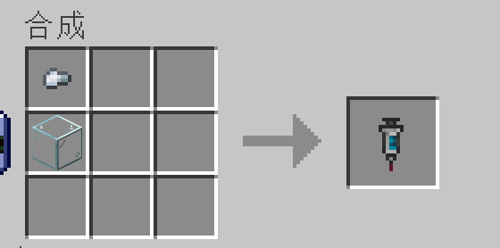
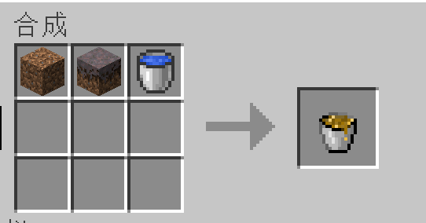
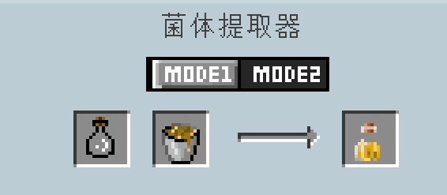
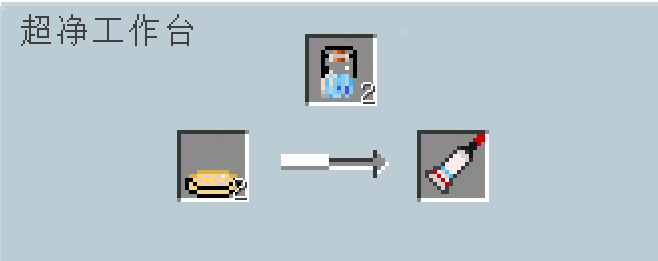
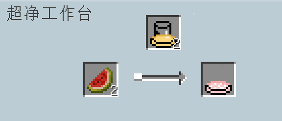
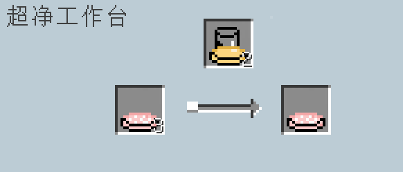
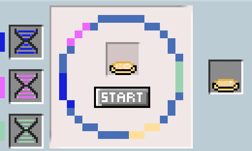

# Bioresistance Mod

  <a href="README.md">中文</a> | <a href="README_EN.md">English</a>

This project integrates our research topic into gameplay, adding a series of items, disease mechanisms, and treatment plans related to biological drug resistance to Minecraft. By simulating microbial drug resistance issues in the real world, we have enhanced the game with challenges in medicine and synthetic biology.

> Disclaimer: This mod was created by Sustech-Bio, the 2025 IGEM team from Southern University of Science and Technology. All developers are welcome to create derivative works; copyright notice is at the bottom of the document.

👈Please give us a free star and favorite this work

## Basic System Introduction

This mod builds a complete biological resistance system that simulates the process of microorganisms developing resistance to drugs in reality. When players use specific drugs to treat diseases, the corresponding pathogens gradually develop resistance, making the drugs progressively ineffective. This forces players to develop more advanced anti-resistance drugs to solve the problem.

## Item Details

### Culture Medium Series
- **Medium** :

  Basic microbial culture material that cannot be used directly and requires sterilization.
- **Medium Sterilized** :

  Sterile medium processed in an autoclave, safe for inoculating specific microorganisms. The starting point for all microbial cultivation.
- **E_coli_medium** :

  Culture medium containing active E. coli, a key material for synthesizing the T6SS system. The E. coli in the medium can be amplified by mixing with new sterilized medium.
- **Acidovorax_citrulli_medium** :

  Special culture medium containing Acidovorax citrulli, which naturally carries genes for the T6SS system and can be used to extract key DNA fragments in the plasmid extractor.
- **E_coli_t6ss_medium** :

  Genetically engineered E. coli containing the T6SS system from Acidovorax citrulli, effective against resistant pathogens and a core ingredient for advanced medications.

### Medication Series
- **Metronidazole** :

  Anti-anaerobic bacterial drug, effective for treating tetanus. Used by right-clicking. Each use increases tetanus bacteria resistance by 0.1%. The item tooltip displays the current resistance percentage.
- **Streptomycin** :

  Antibiotic drug effective against plague bacteria. Used by right-clicking. Each use increases plague bacteria resistance by 0.1%.
- **Antifungal_drug** :

  Specific antifungal drug for treating Candida auris infections. Used by right-clicking. Each use increases Candida auris resistance by 0.1%.
- **Anti_drug_resistant_microbial_capsules** :

  Revolutionary drug developed using T6SS that can combat all resistant pathogens, ignoring pathogen resistance! The ultimate solution for treating all infections.
- **Anti_drug_resistant_microbial_ointment** :

  External product combining T6SS with hydrogel, suitable for Candida auris infections, ignoring Candida auris resistance! The ultimate solution for treating Candida auris infections.

### Experimental Materials and Tools
- **Syringe** :

  Multi-functional experimental tool used for precise microbial extraction and drug injection. A necessary tool for many synthesis recipes. Crafted from iron nuggets and glass on a crafting table.
- **Hydrogel** :

  Polymer material with good biocompatibility, serves as a carrier for anti-resistant microbial ointment.
- **Empty_capsule** :

  Drug packaging material used to package active ingredients and ensure drugs can safely reach specific sites in the body.
  
- **Soil Extract Bucket** :

  Soil-microbe mixture containing microorganisms that can be extracted in a bacterial extractor.

### Microbial Extracts
- **E_coli_extract** :

  E. coli suspension isolated from soil extract, containing active E. coli, the raw material for making E. coli culture medium.
- **Antibiotic_bacteria_extract** :

  Antibiotic-producing microorganisms isolated from soil, a key raw material for making various antibiotic drugs.

### Genetic Engineering Materials
- **DNA_segment_1** :

  Membrane complex from T6SS, the structural foundation of the T6SS system.
- **DNA_segment_2** :

  Baseplate structure from T6SS, the functional support part of the T6SS system.
- **DNA_segment_3** :

  Tube/sheath complex from T6SS, the functional execution part of the T6SS system.

### Animal-Related Items
- **Raw_rat_meat** :

  Has a 1% chance of causing plague infection lasting 5 minutes when consumed.
- **Cooked_rat_meat** :

  Safe food source with no infection risk.
- **Rat_spawn_egg** :

  Used to spawn rat entities.

## New Creatures

This mod adds two new creatures

### Rat

- **Characteristics**:
  Small neutral mob, moves quickly and stealthily, mainly active in dark areas, **spreads plague**.
- **Spawn Locations**:
  Throughout the Overworld, with higher spawn rates in villages.
- **Behavior Patterns**:
  - Neutral mob, will counter-attack when attacked
  - Actively attacks zombies (because it likes to eat rotten flesh)
  - Will be chased and attacked by cats and ocelots; will flee when encountering cats and ocelots
- **Danger Level**:
  Attacking the player has a 1% chance of spreading plague, one of the main sources of plague in the game.
- **Drops**:
  - Raw rat meat: Edible but with a 1% risk of plague infection
- **Counter Strategy**:
  Cats!

### Doctor Villager

- **Characteristics**:
  Special villager type wearing a white coat, able to provide medical services and drug trades.
- **Spawn Locations**:
  Naturally spawns only in clinic structures, an important source of primary drugs.
- **Trade Contents**:
  - Basic medicines: Streptomycin, Metronidazole, Antifungal drug
  - Medical raw materials: Empty capsules, Syringes
    

    
    

- **Interaction Method**:
  - Right-click to open trade interface
- **Value**:
  Important support for fighting diseases in the early game, but as resistance increases, players need to turn to developing advanced drugs.

## Disease Mechanism Explanation

### Exhaustion 
- **Trigger Condition**:
  Players automatically acquire this status after 72000 game ticks (3 game days) without sleeping
- **Symptoms**:
  Causes reduced mining and attack speed, slowed movement, duration is unlimited until the player sleeps
- **Risk**:
  While in an exhausted state, there is a 0.5% chance of being infected with Candida auris, reducing survival ability
- **Solution**:
  Sleeping in a bed will eliminate the exhausted state

### Plague 
- **Infection Conditions**:
  1% chance of infection when eating raw rat meat, 1% chance of infection each time attacked by a rat.
- **Symptoms**:
  Causes weakness and slowness effects, 1 point of damage every 5s, lasts for 5 minutes, immediate death if not cured by the end of the duration.
  
  

  
  

  
- **Treatment Method**:
  Use Streptomycin with a (100%-resistance) chance of cure, or Anti-drug-resistant Microbial Capsules for 100% cure.
- **Resistance Mechanism**:
  Initial resistance is 0%, increases by 0.1% with each use of Streptomycin, up to a maximum of 100%.
  
  

  
  

### Tetanus 
- **Infection Conditions**:
  - 0.1% chance of infection when mining blocks with iron tools
  - 0.1% chance of infection when attacked by iron weapons/tools
  - 100% infection when attacked by Iron Golems
- **Symptoms**:
  Slowness II and Weakness I effects, lasting 5 minutes, immediate death if not cured by the end of the duration.
  
  
  
- **Treatment Method**:
  Use Metronidazole with a (100%-resistance) chance of cure, or Anti-drug-resistant Microbial Capsules for 100% cure.
- **Resistance Mechanism**:
  Initial resistance is 0%, increases by 0.1% with each use of Metronidazole, up to a maximum of 100%.
  
  

### Candida Infection 
- **Infection Path**:
  When the player is in an "Exhausted" state, or has one of the following diseases: "Plague" or "Tetanus", there is a 0.5% chance of being infected
- **Symptoms**:
  Weakness and slowness effects, lasting 3 minutes. When the countdown ends, nausea effect for 20 seconds followed by immediate death.
  
  
- **Treatment Method**:
  Use Antifungal drug with a (100%-resistance) chance of cure, or Anti-drug-resistant Microbial Capsules for 100% cure.
- **Resistance Mechanism**:
  Initial resistance is 0%, increases by 0.1% with each use of Antifungal drug, up to a maximum of 100%.
  
  

## Special Blocks and Devices

### Bacterial Extractor 

- **Function**:
  Extract different types of microorganisms from soil extract.
- **Usage Method**:
  Insert soil extract bucket and glass bottles, switch between two modes to extract different microorganisms.
- **Mode 1**:
  Extract E. coli extract for making E. coli culture medium.
- **Mode 2**:
  Extract antibiotic bacteria extract for making antibiotic drugs.

### Plasmid Extractor 

- **Function**:
  Extract and assemble DNA fragments for genetic engineering operations.
- **Usage Method 1**:
  Place Acidovorax citrulli medium on the left, click the start button to extract 3 DNA fragments.
- **Usage Method 2**:
  Place 3 different DNA fragments in the right 3 slots, E. coli medium in the middle, click the start button to synthesize E. coli T6SS medium.

### Clean Bench 

- **Function**:
  Perform sterile operations, synthesize advanced microbial products.
- **Main Uses**:
  Make various culture media and drugs, one of the most important synthesis devices in the mod.
- **Characteristics**:
  Ensures no microbial contamination, guarantees the purity of biological products.

### Autoclave 

- **Function**:
  Sterilize culture media using high temperature and pressure, ensuring sterility.
- **Usage Method**:
  Place culture medium, water bucket, and **fuel (any vanilla fuel works)**, after activation you get sterilized medium.

### Clinic

- **Function**:
  World generation structure for treating diseases and obtaining medical resources.
- **Generation Location**:
  Mainly generates naturally in plains biomes, use the `/locate structure bio-resistance:clinic` command to find the nearest clinic.
- **Characteristics**:
  **Doctor Villagers** spawn inside, making it an excellent place to obtain basic medicines in the early game.
- **Admin Commands**:
  Administrators can use `/spawnClinic` to generate a clinic structure at the current location, and `/locate structure bio-resistance:clinic` to locate the nearest village to your current position.

## Game Mechanics and Balance

- **Resistance Growth**:
  Using regular drugs causes resistance to increase, which is a cumulative global variable affecting all players.
- **Resistance Challenge**:
  As the game progresses, the effectiveness of regular drugs gradually decreases, forcing players to turn to more advanced solutions.
- **T6SS System**:
  Represents the ultimate weapon against drug resistance, but the acquisition process is complex, requiring a series of experiments and synthesis.
- **Disease Risk**:
  Various diseases have different infection paths and danger levels, players need to be mindful of protection and prepare treatment plans.

## Crafting Recipes

### Basic Crafting

- Iron Nugget + Glass = Syringe (Inventory/Crafting Table)

  

  

- Dirt + Mycelium + Water Bucket = Soil Extract Bucket (Inventory/Crafting Table)

   

  

- Kelp + Water Bucket = Kelp Bucket (Inventory/Crafting Table)

   

  

- Kelp Bucket + Furnace Smelting = Agar Block

   

  

- Agar Block + Glass = Medium (Crafting Table)

   

  

- Slime Ball + Water Potion = Hydrogel (Crafting Table)

  

- Iron Ingot + Copper Ingot + Cauldron + Furnace + Iron Block = Autoclave (Crafting Table)
  
  
  
- Iron Ingot + Glass + Iron Block + Copper Block = Clean Bench (Crafting Table)
  
  
  
- Iron Block + Glass + Clean Bench = Plasmid Extractor (Crafting Table)
  
  
  
- Iron Block + Brewing Stand + Hopper = Bacterial Extractor (Crafting Table)
  
  

### Autoclave Synthesis

- Medium + Water Bucket = Medium Sterilized (Autoclave)

  
  
  

### Bacterial Extractor Synthesis

- Soil Extract Bucket + Glass Bottle = E_coli_extract (Mode 1) / Antibiotic_bacteria_extract (Mode 2)

   

  

    

### Clean Bench Synthesis

- Antibiotic_bacteria_extract + Syringe = Random generation of Streptomycin/Metronidazole/Antifungal_drug

   

   

   

  

- E_coli_t6ss_medium + Hydrogel = Anti_drug_resistant_microbial_ointment

  

  

- E_coli_t6ss_medium + Empty_capsule = Anti_drug_resistant_microbial_capsules

  

  

- Medium_sterilized + E_coli_t6ss_medium = E_coli_t6ss_medium (Species Inheritance)

  

  

- Medium_sterilized + Melon = Acidovorax_citrulli_medium

  

  

- Medium_sterilized + Acidovorax_citrulli_medium = Acidovorax_citrulli_medium (Species Inheritance)

  

  

- Medium_sterilized + E_coli_extract = E_coli_medium

  

  

- Medium_sterilized + E_coli_medium = E_coli_medium (Species Inheritance)

  
  
  

### Plasmid Extractor Synthesis

- (Left Extraction Module) Acidovorax_citrulli_medium → 3 DNA Segments (DNA_segment_1, DNA_segment_2, DNA_segment_3)

  

  

- (Right Injection Module) 3 DNA Segments + E_coli_medium → E_coli_t6ss_medium

  

## Command System

All commands start with `/bioresistance`, mainly used for managing resistance values:

- `/bioresistance help`:
  Display all available commands
- `/bioresistance tetanus_resistance set <value>`:
  Set tetanus resistance value (value from 0-1)
- `/bioresistance plague_resistance set <value>`:
  Set plague resistance value (value from 0-1)
- `/bioresistance candida_resistance set <value>`:
  Set Candida resistance value (value from 0-1)

These commands are mainly for server administrators to adjust game difficulty and balance.

In addition, there are clinic-related commands:

- `/locate structure bio-resistance:clinic`:
  Find the location of the nearest clinic structure

## Installation and Experience

**Installation Notes:**

* ❗This mod is developed based on Minecraft 1.20.4

- Fabric Loader version used is 0.16.14
- Fabric API version is 0.97.2+1.20.4
- Required mod: [geckolib-forge-1.20.4-4.4.4.jar](https://www.mcmod.cn/download/3232.html)
- Recommended launcher: [PCL Latest Official Version](https://afdian.com/p/0164034c016c11ebafcb52540025c377)
- When downloading new game versions in PCL 2, use the following configuration:

  

**Installation Steps:**

Go to [Release Test Version 1.0.0](https://github.com/EricFeng9/sustech_bioresistance/releases/tag/1.0.0)

Download the following files:

Go to [geckolib-forge-1.20.4-4.4.4.jar](https://www.mcmod.cn/download/3232.html) to download the following file:

Place the above files in the `.minecraft\mods\` folder (or `game version root directory\mods\`), then start the game

## Feedback and Issues

Please contact **2504170651@qq.com**

## Copyright Notice

This work is created by members of the 2025 IGEM team Sustech-Bio.

Main contributors:

* Feng Junming (Class of 2023, Department of Computer Science and Engineering) - Code writing/Planning/Art
* Sun Han (Class of 2023, Department of Computer Science and Engineering) - Code writing/Planning
* Chen Yao (Class of 2022, Department of Biology) - Art
* Yang Tianci (Class of 2023, Department of Biomedical Engineering) - Planning
* Qi Tianjian (Class of 2022, Department of Biology) - Planning
* Su Hengwei (Class of 2023, Department of Biology) - Sustech-Bio Team Leader
* Other members of the Sustech-Bio team

This work is licensed under the [Creative Commons Attribution-ShareAlike 4.0 International License](http://creativecommons.org/licenses/by-sa/4.0/).

For reposting or derivative works, please include the link to this work: https://github.com/EricFeng9/sustech_bioresistance

Follow the **Sustech-Bio** official WeChat account👇for the team's latest updates

---

